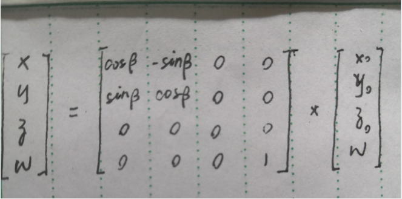
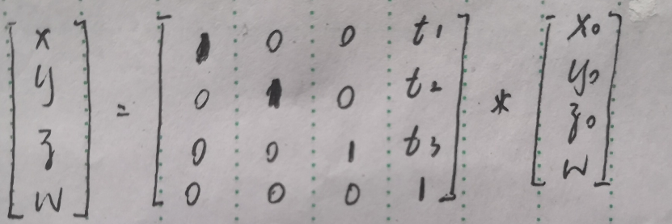
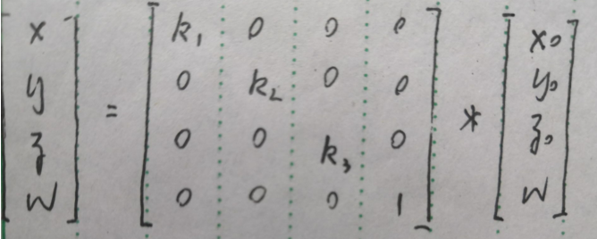
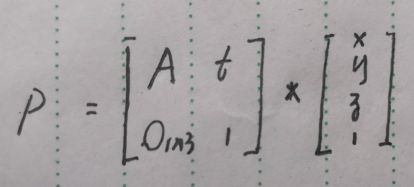

# Flutter Matrix4 分析

## 前言

一般情况下，视图的表示是3D的，这意味可以用一个三维坐标系来表示视图

即一个图形的每个点都可以用 P(x,y,z) 来唯一表示

通常，图形变换操作有三种：

1.旋转

2.平移

3.缩放

（错切可以看作由平移和旋转（只对x,y,z其中一个进行旋转）的结果）

而为了叠加变换效果，可以用矩阵来简化运算。

综上，一个三维矩阵应该足以表示所需要的三维变换，但是Flutter使用了Matrix4而不是三维矩阵来进行操作

把坐标写成如下形式，并考虑平移的情况：

```dart
|x`|   |x|   |t1|
|y`| = |y| + |t2|
|z`|   |z|   |t3|
```

显然，不能将原坐标写作一个与矩阵相乘的形式来表示平移操作，为此，我们引入其次坐标系

用**N + 1维向量来表示N维坐标**

参考链接：

齐次坐标系和仿射变换：

https://www.jianshu.com/p/6aa6080373ab

https://oncemore2020.github.io/blog/homogeneous/ 

https://www.cnblogs.com/W-Heisenberg/p/4634661.html

之后我们将坐标写成如下形式：

三维坐标系中的R(x0,y0,z0)用齐次坐标表示为P(x,y,z,w)

其中 x0 = x/w, y0 = y/w, z0 = z/w

```dart
|x|
|y|
|z|
|w|    
```


## 旋转

假设有原点P0(x0,y0,0)，与x的夹角为α，将它绕z轴顺时针旋转β得到点P(x,y,0)，它到原点距离r

则：

x0 = r cosα

y0 = r sinα

x = r * cos(α + β) = r * cosα * cosβ - r * sinα * sinβ = x0 * cosβ - y0 * sinβ

y = r * sin(α + β) = r * sinα * cos β + r * sin β * cos α = y0 * cosβ - x0 * sin β    



类似地可以得到 y，z的变换矩阵

而对于非单一轴的旋转，可以看作由多次绕单一轴的旋转叠加而成


## 平移

假设有原点P0(x0,y0,z0)，将它平移一段距离d(t1,t2,t3)得到点P(x,y,z)

则：

x = x0 + t1;

y = y0 + t1;

z = z0 + t1;




## 缩放

假设有原点P0(x0,y0,z0)，将它缩放r(k1,k2,k3)得到点P(x,y,z)

x = k1 * x0

y = k2 * y0

z = k3 * z0




## 总结

综上，可以得到统一的表达方式：



其中：

A 是3 * 3矩阵，控制旋转和缩放

T 是3 * 1矩阵，控制平移

O 是1* 3矩阵，全为0

由此分析可以理解Matrix4源码

